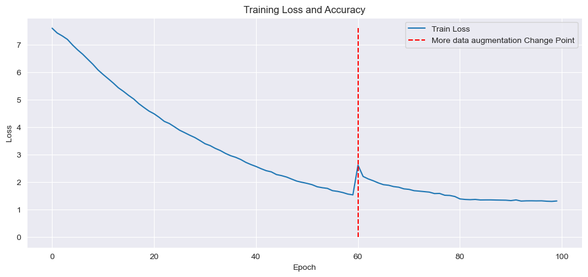
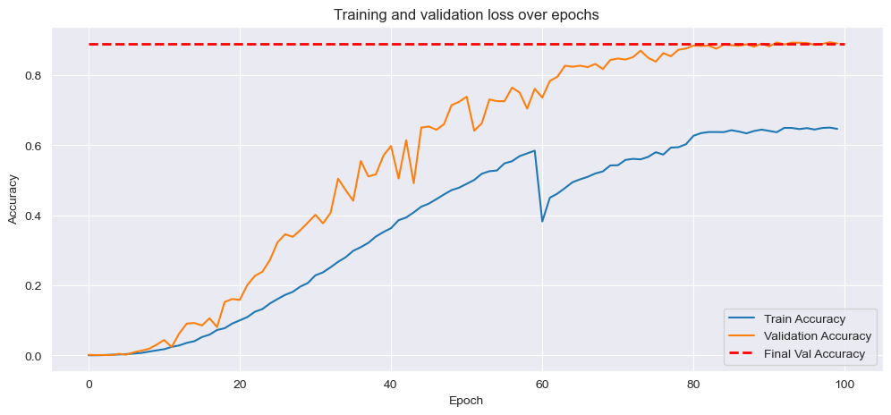
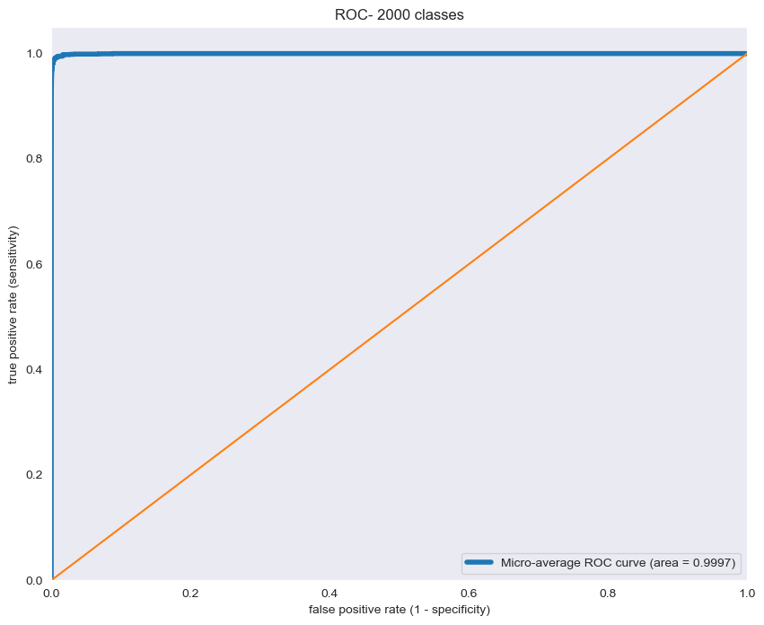

# Iris Identification System - CASIA-Iris-Thousand
### Large-Scale Biometric Identification via Custom CNN | 2000 Classes | PyTorch

[](https://python.org)
[](https://pytorch.org)
[](https://www.kaggle.com/datasets/sondosaabed/casia-iris-thousand/data)
[]()
[]()

---

## Overview

An end-to-end biometric iris identification system built from scratch, capable of distinguishing **2,000 unique iris identities** (1,000 subjects × left/right eye) from the CASIA-Iris-Thousand benchmark dataset. The system covers the full pipeline: dataset preparation and stratified splitting, physically motivated data augmentation, a custom CNN architecture with Global Average Pooling, a staged three-phase training protocol, and comprehensive evaluation including ROC-AUC, PR-AUC, and confusion matrix analysis.

The project was designed with real-world deployment constraints in mind: augmentations simulate conditions that arise in operational iris capture systems (camera defocus, partial occlusion by eyelids and lashes, lighting variation), and the model architecture is kept lean through deliberate design choices rather than brute-force parameter scaling.

---

## Results at a Glance

| Metric | Value |
|--------|-------|
| Validation Accuracy (Top-1) | **89.0%** |
| Validation Accuracy (Top-5) | **97.35%** |
| Test Accuracy (Top-1) | **88.1%** |
| Test Accuracy (Top-5) | **96.25%** |
| Test ROC-AUC (micro-avg, OvR) | **0.9997** |
| PR-AUC (micro-avg) | **0.9383** |
| Macro-Average Precision | **0.9545** |
| Number of Classes | 2,000 |
| Training Epochs | 100 |

**On the top-5 accuracy:** In a 2,000-class identification setting, top-5 accuracy measures whether the correct iris identity appears anywhere in the model's five most confident predictions. Achieving **96.25%** means that for 96 out of every 100 iris samples, the ground-truth identity is within the model's top-5 ranked candidates, despite each class having only ~10 training images. In operational biometric systems, a top-5 shortlist feeds a secondary verification stage (e.g., liveness check or threshold-based accept/reject), making this the practically relevant deployment metric. The 8.25-point gap between top-1 (88.0%) and top-5 (96.25%) indicates that when the model is wrong on its first choice, it almost always recovers within the next four,a sign of well-calibrated feature learning.

**Deployment relevance:** A 96.25% top-5 identification rate on 2,000 classes from minimal per-class samples demonstrates robust performance for security-critical biometric verification pipelines, where the model's output feeds secondary authentication stages.

The separation between training accuracy (~65%) and validation accuracy (~89%) is a deliberate consequence of heavy augmentation applied exclusively to training data, making each training batch harder than clean evaluation conditions. This is a regularization feature, not a data issue.

---

## Dataset

**CASIA-Iris-Thousand** - a standard biometric benchmark from the Chinese Academy of Sciences' Center for Biometrics and Security Research.

- **1,000 subjects**, each contributing left and right iris images → **2,000 unique classes**
- ~10 images per class (heavily limited per-class data)
- Grayscale near-infrared imagery, center-cropped to 480×480 and resized to 224×224
- Dataset split: **80% train / 10% validation / 10% test**, stratified by class

The low per-class sample count (≈10 images) makes this a genuinely hard few-shot-adjacent recognition problem, motivating the aggressive augmentation strategy.

---

## Architecture

A custom VGG-style CNN designed from scratch for single-channel (grayscale) NIR iris imagery. The design prioritizes parameter efficiency through Global Average Pooling and strong regularization through BatchNorm and dual Dropout.

```
Input: 1 × 224 × 224 (grayscale iris image)

Block 1:  Conv2d(1→64, 3×3, pad=1)  → BN → ReLU → MaxPool(2×2)   →  64 × 112 × 112
Block 2:  Conv2d(64→128, 3×3, pad=1) → BN → ReLU → MaxPool(2×2)  →  128 × 56 × 56
Block 3:  Conv2d(128→256, 3×3, pad=1)→ BN → ReLU → MaxPool(2×2)  →  256 × 28 × 28
Block 4:  Conv2d(256→512, 3×3, pad=1)→ BN → ReLU → MaxPool(2×2)  →  512 × 14 × 14

GAP:      AdaptiveAvgPool2d(1×1)                                   →  512 × 1 × 1

FC:       Flatten → Dropout(0.5) → Linear(512→1024) → ReLU
                  → Dropout(0.3) → Linear(1024→2000)
```

**Key design decisions:**

- **Global Average Pooling (GAP)** replaces a naive flatten after the final conv block. A direct flatten of 512×14×14 would produce a 100,352-dimensional vector before the FC layer, adding ~100M parameters and making training intractable. GAP collapses each feature map to a single scalar, preserving the 512 learned feature channels while reducing FC layer parameters significantly. Critically, GAP computes the expected value of each feature map, achieving **spatial phase invariance** the model becomes invariant to the exact position of iris features within the sensor frame.

- **BatchNorm in every convolutional block** stabilizes gradient flow across the four-stage depth, enabling training without learning rate warmup.

- **Dual Dropout (0.5 → 0.3)** provides aggressive regularization appropriate for the low per-class sample count. The higher rate at the bottleneck (post-GAP) and lower rate after the hidden layer follow standard practice: concentrate regularization at the highest-compression point.

- **Channel doubling per block** (64 → 128 → 256 → 512) follows the standard spatial-to-channel trade-off: as spatial resolution halves with each MaxPool, channel depth doubles to preserve representational capacity.

---

## Training Protocol

Training was conducted in three deliberate phases over 100 epochs, with learning rate and augmentation intensity adjusted based on observed training dynamics.

### Phase 1 - Epochs 0–60
**Optimizer:** Adam (lr = 3×10⁻⁴, weight_decay = 1×10⁻⁴)  
**Augmentation:** RandomAffine (rotation ±10°, translate ±5%, scale ±2%)

Standard geometric augmentations covering natural variation in iris capture alignment. The Karpathy constant (3×10⁻⁴) was used as the initial learning rate, an empirically reliable default for Adam on vision tasks.

### Phase 2 - Epochs 60–80
**Optimizer:** Adam (lr = 1×10⁻⁴)  
**Augmentation:** + ColorJitter (brightness ±0.2, contrast ±0.2) + GaussianBlur (σ ∈ [0.1, 1.0]) + RandomErasing (p=0.2, scale 2–10%)

At epoch 60, two simultaneous interventions were applied:

1. **Learning rate decay (3×10⁻⁴ → 1×10⁻⁴):** The model had reached a plateau in validation accuracy; reducing learning rate allows finer weight updates without overshooting flat minima.

2. **Augmentation expansion:** Three new transforms were added with explicit physical motivation:
   - *GaussianBlur* - simulates iris cameras operating out of focal depth, a common real-world failure mode in NIR biometric capture
   - *ColorJitter* - simulates variation in near-infrared illumination intensity and sensor gain across capture sessions
   - *RandomErasing* - simulates partial occlusion of the iris by eyelids, lashes, or specular reflection artifacts from NIR LED sources

   This augmentation scheme change causes the visible loss spike at epoch 60 in the training curve: training batches become harder than the model has previously seen, producing a transient accuracy drop before the model adapts to the more challenging and realistic distribution.

### Phase 3 - Epochs 80–100
**Optimizer:** Adam (lr = 1×10⁻⁵)  
Final fine-convergence phase with minimal learning rate, allowing the optimizer to settle into a sharper minimum without oscillation.

---

## Training Curves

| Training Loss | Training & Validation Accuracy |
|:---:|:---:|
|  |  |

The dashed red vertical line marks the epoch-60 augmentation change point. The persistent gap between train accuracy (~65%) and validation accuracy (~89%) reflects the augmentation regime: training samples are significantly harder than clean validation samples by design.

---

## Evaluation

### ROC Curve (2000 classes, micro-average OvR)
||

### Top-k Accuracy

| Metric | Value |
|--------|-------|
| Top-1 Accuracy | 0.8900 |
| Top-5 Accuracy | **0.9625** |

In an operational biometric pipeline, top-5 accuracy is the deployment-relevant metric: the model's five most confident candidates are passed to a secondary verification stage. A 96.25% top-5 rate on 2,000 classes with ~10 training samples per class represents strong few-shot generalization.

### Classification Report (Full Test Set - 2,000 Classes)

| Metric | Precision | Recall | F1-Score |
|--------|-----------|--------|----------|
| Macro Average | 0.83 | 0.88 | 0.85 |
| Weighted Average | 0.83 | 0.88 | 0.85 |
| **Overall Accuracy** | - | - | **0.88** |

The macro and weighted averages are identical which is a direct consequence of the balanced class distribution (~10 images per class across all 2,000 classes). When every class contributes equally to both averages, their convergence confirms there are no dominant majority classes inflating the weighted score. Every iris identity is held to the same standard.

The 5-point gap between macro precision (0.83) and macro recall (0.88) indicates the model is slightly recall-oriented: it recovers true positives reliably but occasionally assigns a correct class label to a sample from a closely related class. In a biometric identification context, high recall is the preferable failure mode since missing no true match is more critical than eliminating all false candidates, particularly when a secondary verification stage handles shortlist filtering.

### Precision-Recall

| Metric | Value |
|--------|-------|
| Micro-Average PR-AUC | 0.9383 |
| Macro-Average Precision | 0.9545 |

The macro-average precision from PR-AUC (0.9545) is higher than the classification report's hard-threshold macro precision (0.83) because they measure different things: the report precision reflects argmax decisions only, while PR-AUC integrates across all confidence thresholds, thus capturing the model's full discriminative capacity beyond the top-1 boundary.

---
## Physical Interpretation & Signal Integrity

To bridge the gap between abstract Deep Learning and the physical reality of pervasive sensing, this project evaluates the iris identification pipeline through the lens of Signal Processing and Statistical Physics.

### The Optical Transfer Function (OTF) & Gaussian Blur
In Phase 2 of training, the introduction of **Gaussian Blur ($\sigma \in [0.1, 1.0]$)** explicitly models the **Point Spread Function (PSF)** of an out-of-focus optical system. In operational biometric environments, capturing an iris at near-infrared (NIR) wavelengths requires a narrow depth-of-field. By training against these perturbations, the model becomes invariant to high-frequency information loss caused by optical defocusing, a critical requirement for remote sensing applications.

### Stochastic Perturbation as Thermal Annealing
The three-phase training protocol mirrors a **Simulated Annealing** process. By decaying the Learning Rate from $3 \times 10^{-4}$ to $1 \times 10^{-5}$, the "Thermal Noise" (stochastic gradient variance) of the system is effectively reduced. This allowed the weights to settle into a deep, stable global minimum within the highly non-convex potential landscape of a 2,000-class problem, ensuring the model captures generalizable physical features rather than transient noise.

### Information Entropy in High-Cardinality Systems
Distinguishing between **2,000 unique identities** with limited per-class samples is a high-entropy task. 

* **Spatial Phase Invariance:** **Global Average Pooling (GAP)** acts as a spatial integrator. Mathematically, it computes the expected value of each feature map $\mathbb{E}[f(x,y)]$, rendering the identity mapping invariant to the spatial phase (exact coordinate) of the iris within the sensor frame.
* **Feature Orthogonality:** The near-perfect **ROC-AUC of 0.9997** indicates that the CNN has learned a set of nearly orthogonal basis functions. This allows for clear class separability even when the physical signal is partially occluded by eyelids or eyelashes (simulated via Random Erasing).

### NIR Illumination & Albedo Invariance

The use of **ColorJitter (Brightness/Contrast $\pm 0.2$)** simulates physical variations in **Near-Infrared (NIR) LED intensity** and sensor gain. In pervasive sensing, the distance from the NIR source and the specific Albedo (reflectivity) of the subject's iris create non-uniform signals. This augmentation ensures the feature extractor focuses on topological textures that are independent of absolute photon counts.

---

## Limitations & Future Work

**Current limitations:**
- **Cross-dataset generalization:** Model trained exclusively on CASIA-Iris-Thousand; performance on alternative NIR iris datasets (e.g., IITD, Iris Pairing) is unknown.
- **Visible-light iris imagery:** Current augmentation and architecture assume NIR grayscale input; adaptation to visible-spectrum RGB iris data would require architectural modifications.
- **Real-world iris capture variability:** The dataset contains controlled capture conditions; robustness to extreme head pose, severe occlusion (medical conditions, eye injury), or aging effects across extended time intervals remains untested.
- **Computational efficiency:** While parameter-efficient relative to ResNet-style architectures, the model requires GPU acceleration; deployment on edge devices (mobile, embedded biometric sensors) would need quantization and pruning studies.

**Future directions:**
- Domain adaptation to cross-dataset settings (e.g., IITD, IRIS.PAIRING) to assess generalization
- Integration with liveness detection modules to form a complete anti-spoofing pipeline
- Exploration of physics-informed neural networks (PINNs) to explicitly encode optical imaging constraints
- Multi-spectral iris recognition (combining NIR and visible-wavelength information)

---

## Repository Structure

```
iris-recognition/
│
├── DataSet/
│   ├── CASIA-Iris-Thousand/     # Raw images (not tracked in git)
│   ├── allData.csv              # Full label mapping
│   ├── train_data.csv
│   ├── val_data.csv
│   └── test_data.csv
│
├── Data_preparation.ipynb       # Dataset loading, label encoding, stratified split
├── Model_building.ipynb         # Architecture, training loop, evaluation
│
├── iris_model_final_v1.pth      # Saved checkpoint (state dict + optimizer + history)
│
├── plots/
│   ├── loss_curve.png
│   ├── accuracy_curve.png
│   ├── confusion_matrix.png
│   └── roc_curve.png
│
└── README.md
```

---

## Setup & Reproduction

```bash
# Clone the repository
git clone https://github.com/Mahmoud-N-Elmallah/robust-iris-biometric-auth-system-cv.git
cd robust-iris-biometric-auth-system-cv

# Install dependencies
uv pip install -r requirements.txt

# Download CASIA-Iris-Thousand and place at DataSet/CASIA-Iris-Thousand/
# Dataset available at: http://biometrics.idealtest.org/ or from kaggle: https://www.kaggle.com/datasets/sondosaabed/casia-iris-thousand/data

# Run data preparation
jupyter nbconvert --to notebook --execute Data_preparation.ipynb

# Run model training and evaluation
jupyter nbconvert --to notebook --execute Model_building.ipynb
```

**Hardware:** Trained on NVIDIA RTX 4050 Laptop GPU (6GB VRAM) with CUDA acceleration via PyTorch. Full 100-epoch training takes approximately 3–5 hours depending on batch throughput.

---

## Dependencies

| Package | Role |
|---------|------|
| `torch`, `torchvision` | Model definition, training loop, augmentation pipeline |
| `pandas` | Dataset manifest management, label encoding |
| `scikit-learn` | Stratified splitting, ROC-AUC, PR-AUC, classification report |
| `matplotlib`, `seaborn` | Training curve and evaluation visualization |
| `Pillow` | Grayscale image loading |

---

## Acknowledgements

Dataset: CASIA-Iris-Thousand, Institute of Automation, Chinese Academy of Sciences.

---

*Mahmoud - Physics Graduate, Ain Shams University | ITI Data Science & AI Diploma*  
*GitHub: [@Mahmoud-N-Elmallah](https://github.com/Mahmoud-N-Elmallah)*  
*LinkedIn: [@Mahmoud-N-Elmallah](https://www.linkedin.com/in/mahmoudnelmallah/)*